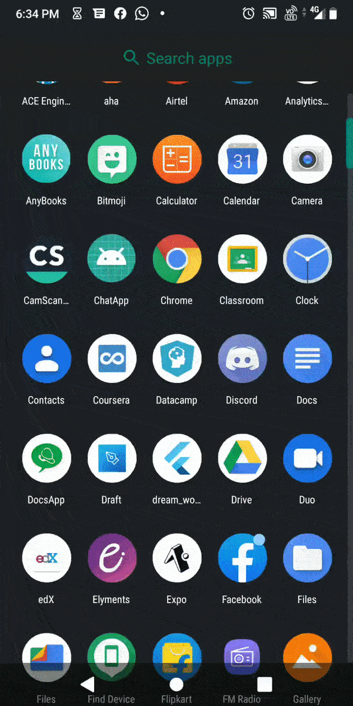
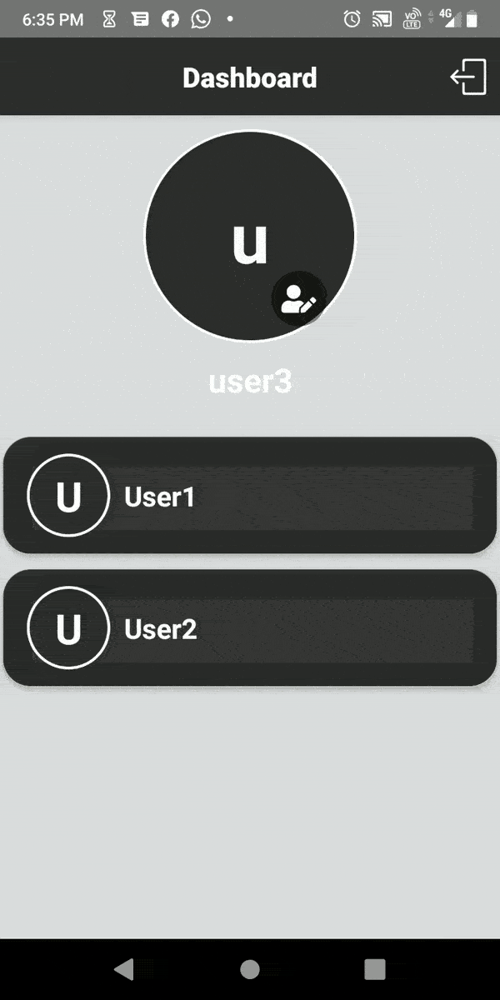
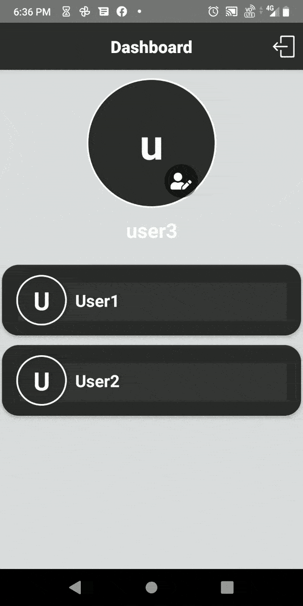

# ChatApp
# **Chat App**

## **Features**
- User Registration and authentication
- One to One Private Chatting
- Only Username will be revealed to Other users and emailid will be confidential
- Infinite scrolling
- Form Validation

## **Detailed TechStack**

- React-Native Cli

**Dependencies:** 

- React native navigation for navigation
- Stacknavigator is used for navigating between screens
- Icons imported from Simpleline icons and materialCommunity icons from react-native-vector-icons.
- User registration and login facility using firebase email & password method
- React native image picker is used for picking images
- Users can upload their picture as profile picture and also can send images in chat session.
- Authentication using firebase
- Messages and Image data are stored in firebase real time data base.

## **Screenshots**

the working demo gif is in images folder of the repo. have a look!

**user registration :**

 

